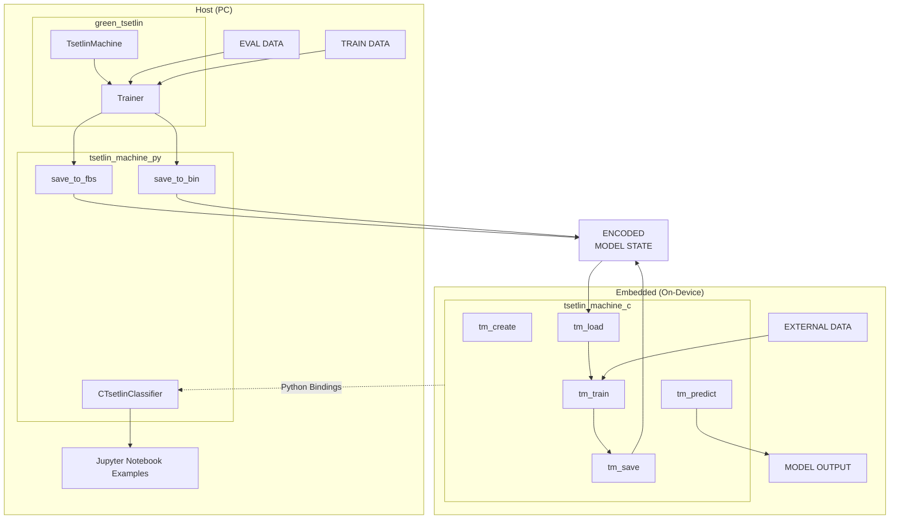

# Tsetlin Machines execution engine
The aim of this work is to develop an execution engine that enables the inference and learning of Tsetlin Machine models on devices with limited resources. The solution should also include a specification of the format for describing Tsetlin Machine models, enabling their portability between machines with different hardware architectures. 

## Features
- Implementation of Tsetlin Machines for on-device training, inference and model saving / loading in C programming language
- Exporting pretrained Tsetlin Machine models from [green_tsetlin](https://github.com/ooki/green_tsetlin) library to a portable format
- FlatBuffers (FBS) model format for efficient serialization and deserialization of Tsetlin Machine models
- Python bindings for easy integration with Scikit-learn applications
- Example Jupyter notebooks demonstrating training and inference using the developed library

## Diagram


## Project Structure
<!-- TODO -->

## Requirements
- CMake 3.23+
- GCC-13 Compiler recommended
- [uv Python manager](https://github.com/astral-sh/uv) (optional, for green_tsetlin integration and jupyter notebooks examples)

## Build
```bash
cmake -B build
cmake --build build
```

## Build options
Defaults set in [CMakeLists.txt](CMakeLists.txt)
- `-DBUILD_FLATCC=ON/OFF` : Build FlatCC from third_party
- `-DBUILD_PYTHON=ON/OFF` : Enable building Python bindings
- `-DBUILD_EXAMPLES=ON/OFF` : Enable building examples
- `-DBUILD_TESTING=ON/OFF` : Enable building third_party tests

## Install
```bash
cmake -B build -DCMAKE_INSTALL_PREFIX=install -DBUILD_SHARED_LIBS=ON
cmake --build build
cmake --install build --component tsetlin_machine_c
```

## Install with Python
```
uv sync
```

## TODOs
<!-- TODO: Update TODOs -->
1. Consider feasability of using memmap when loading models
2. Print learning debug (e.g. accuracy) every iteration during training
3. Add manually adding rules to the model
4. Add prediction explananations
5. Add README.md with project description, screenshots and usage instructions
6.  Test exporting to edge devices with different architectures
7.  (Optional) Complete and add FBS to Sparse TM
