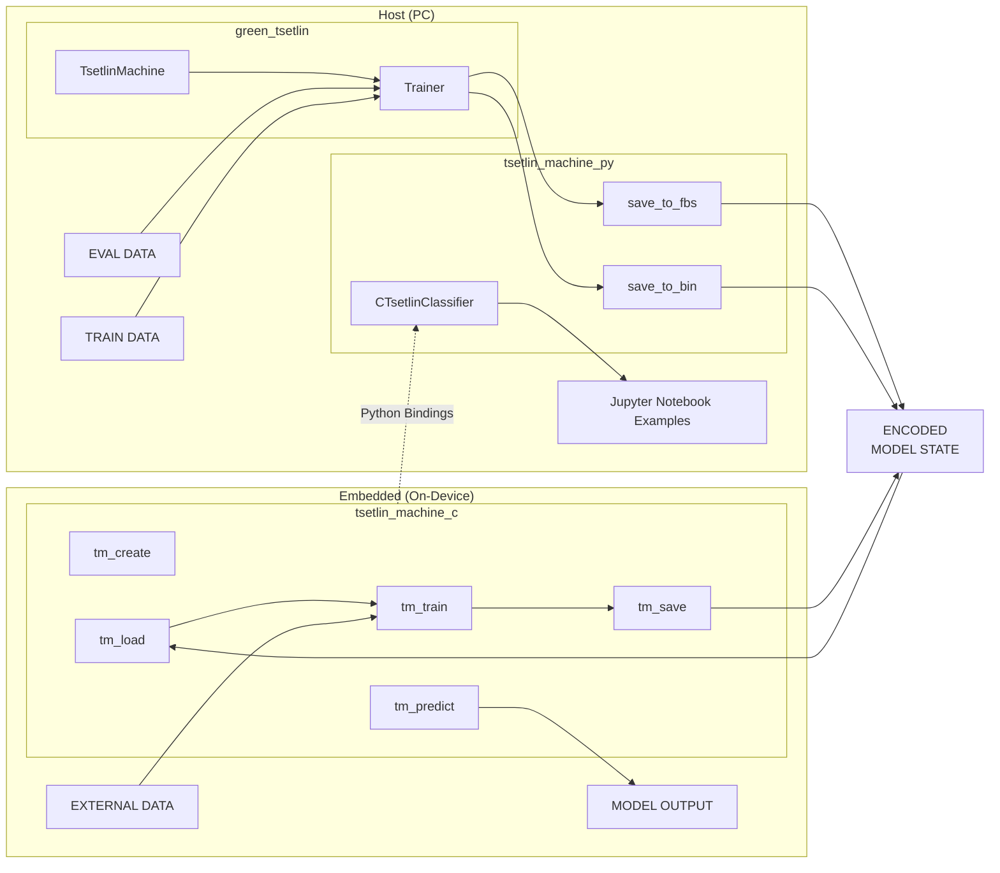

# Tsetlin Machines execution engine
The aim of this work is to develop an execution engine that enables the inference and learning of Tsetlin Machine models on devices with limited resources. The solution should also include a specification of the format for describing Tsetlin Machine models, enabling their portability between machines with different hardware architectures. 

## Features
- Implementation of Tsetlin Machines for on-device training, inference and model saving / loading in C programming language
- Exporting pretrained Tsetlin Machine models from [green_tsetlin](https://github.com/ooki/green_tsetlin) library to a portable format
- FlatBuffers (FBS) model format for efficient serialization and deserialization of Tsetlin Machine models
- Python bindings for easy integration with Scikit-learn applications
- Example Jupyter notebooks demonstrating training and inference using the developed library

## Diagram


## Project Structure
- [`CMakeLists.txt`](CMakeLists.txt) : Root CMake build configuration
- [`pyproject.toml`](pyproject.toml) : Python build configuration (uses `scikit-build-core`)
- [`third_party/`](third_party/) : Third party dependencies
  - [`CMakeLists.txt`](third_party/CMakeLists.txt) : CMake configuration for building third party dependencies
  - [`flatbuffers/`](third_party/flatbuffers/) : FlatBuffers compiler and runtime for Python
  - [`flatcc/`](third_party/flatcc/) : FlatCC FlatBuffers compiler and runtime for C
  - [`Unity/`](third_party/Unity/) : Unity test framework for C
- [`schemas/`](schemas/) : FlatBuffers schemas for Tsetlin Machine model serialization
  - [`CMakeLists.txt`](schemas/CMakeLists.txt) : CMake configuration for generating FlatBuffers interface code
  - [`tsetlin_machine.fbs`](schemas/tsetlin_machine.fbs) : Main schema for Dense Tsetlin Machine model
- [`src/`](src/) : Source code directory
  - [`tsetlin_machine_c/`](src/tsetlin_machine_c/) : C implementation of Tsetlin Machines
    - [`CMakeLists.txt`](src/tsetlin_machine_c/CMakeLists.txt) : CMake configuration for Tsetlin Machine C module
    - [`src/`](src/tsetlin_machine_c/src/) : Source files for all Tsetlin Machine models and functionalities
      - [`fast_prng.c`](src/tsetlin_machine_c/src/fast_prng.c) : Fast Pseudo-Random Number Generator implementation
      - [`tsetlin_machine.c`](src/tsetlin_machine_c/src/tsetlin_machine.c) : Dense Tsetlin Machine implementation
      - [`sparse_tsetlin_machine.c`](src/tsetlin_machine_c/src/sparse_tsetlin_machine.c) : WIP Sparse Tsetlin Machine implementation
      - [`stateless_tsetlin_machine.c`](src/tsetlin_machine_c/src/stateless_tsetlin_machine.c) : WIP Stateless Tsetlin Machine implementation
    - [`include/`](src/tsetlin_machine_c/include/) : Header files for Tsetlin Machine C module
  - [`tsetlin_machine_py/`](src/tsetlin_machine_py/) : Python integrations with `green_tsetlin` and tsetlin_machine_c
    - [`c_tsetlin_clf.py`](src/tsetlin_machine_py/c_tsetlin_clf.py) : Bindings for Tsetlin Machine C module with Scikit-learn interface
    - [`green_tsetlin_clf.py`](src/tsetlin_machine_py/green_tsetlin_clf.py) : Scikit-learn interface for `green_tsetlin` Dense TM
    - [`green_tsetlin_sparse_clf.py`](src/tsetlin_machine_py/green_tsetlin_sparse_clf.py) : Scikit-learn interface for `green_tsetlin` Sparse TM
    - [`gt_to_fbs.py`](src/tsetlin_machine_py/gt_to_fbs.py) : Export `green_tsetlin` models to FlatBuffers format
    - [`gt_to_bin.py`](src/tsetlin_machine_py/gt_to_bin.py) : Export `green_tsetlin` models to binary format
- [`examples/`](examples/) : Examples demonstrating usage of the library
  - [`CMakeLists.txt`](examples/CMakeLists.txt) : CMake configuration for building examples
  - [`notebooks/`](examples/notebooks/) : Examples using Python bindings
    - [`noisy_xor.ipynb`](examples/notebooks/noisy_xor.ipynb) : Notebook comparing our library with other ML models on noisy XOR problem
    - [`digits.ipynb`](examples/notebooks/digits.ipynb) : Notebook demonstrating Tsetlin Machine on MNIST digits dataset
    - [`f_mnist.ipynb`](examples/notebooks/f_mnist.ipynb) : Notebook demonstrating Tsetlin Machine on Fashion MNIST dataset
    - [`noisy_xor_testing.ipynb`](examples/notebooks/noisy_xor_testing.ipynb) : Notebook for testing our TMs configurations on noisy XOR problem
- [`tests/`](tests/) : Tests implementation
  - [`CMakeLists.txt`](tests/CMakeLists.txt) : CMake configuration for building tests
  - [`c/`](tests/c/) : C tests for Tsetlin Machine C module using Unity framework
    - [`test_runner.c`](tests/c/test_runner.c) : Test runner for executing all C tests
- [`tmp/`](tmp/) : Not yet categorized code snippets and experiments

## Requirements
- CMake 3.23+
- GCC-13 Compiler recommended
- [uv Python manager](https://github.com/astral-sh/uv) (optional, for `green_tsetlin` integration and jupyter notebooks examples)

## Build
```bash
cmake -B build
cmake --build build
```

## Build Options
Defaults set in [CMakeLists.txt](CMakeLists.txt)
- `-DBUILD_FLATCC=ON/OFF` : Build FlatCC from third_party
- `-DBUILD_PYTHON=ON/OFF` : Enable building Python bindings
- `-DBUILD_EXAMPLES=ON/OFF` : Enable building examples
- `-DBUILD_TESTING=ON/OFF` : Enable building third_party tests

## Install
```bash
cmake -B build -DCMAKE_INSTALL_PREFIX=install -DBUILD_SHARED_LIBS=ON
cmake --build build
cmake --install build --component tsetlin_machine_c
```

## Install with Python
```
uv sync
```

## Roadmap
- **Testing and Benchmarking**
   - **Edge Device Validation:** Conduct testing on various edge device architectures (e.g. Raspberry Pi Pico). 
   - **Comparative Performance:** Benchmark learning performance and accuracy against other ML models at every few iterations during training.
   - **Efficiency Analysis:** Measure the number of instructions utilized per prediction and per training epoch.
   - **Resource Utilization**
     - Assess model memory usage.
     - Compare model size with the `green_tsetlin` implementation across different parameter settings.
     - Determine the size of our C library.

- **Optional Enhancements**
  - **Memory Loading Optimization:** Consider implementing memory-mapping (`memmap`) when loading models within [`tsetlin_machine.c`](src/tsetlin_machine_c/src/tsetlin_machine.c).
  - **Manual Rule Integration:** Add functionality to allow manually adding rules to the model.
  - **Prediction Explainability:** Implement prediction explanations (e.g. showing which rules contributed to the result).
  - **Sparse Tsetlin Machines:** Complete the Sparse Tsetlin Machine model and integrate the FlatBuffers format for it.
